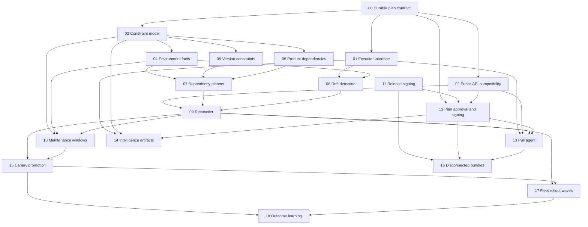

# Execution roadmap

The roadmap is a dependency graph, not a serial checklist. Plan numbers remain
stable references while ready plans may run concurrently.

## Dependency graph

## Parallel execution waves

| Wave | Plans that can run in parallel | Convergence condition |
| --- | --- | --- |
| A | 00 and 11 | Durable plan representation and release trust both exist |
| B | 01, 02, and 03 | Shared execution, API, and constraint seams are stable |
| C | 04, 05, 06, and 12 | Facts, version policy, dependencies, and plan trust exist |
| D | 07 and 08 | Planning handles both dependency order and observed drift |
| E | 09 and 14 | Reconciliation works; intelligence delivery can use the stable executor independently |
| F | 10 and 13 | Scheduling policy and remote execution are available |
| G | 15 and 16 | Connected canary rollout and disconnected delivery are both operational |
| H | 17 | Fleet waves combine reconciliation with canary evidence |
| I | 18 | Learning starts only after normalized fleet outcomes exist |

Plans within a wave may be assigned simultaneously. A later-wave plan may
start early whenever its own dependencies are complete; the table optimizes
for low integration churn rather than enforcing barriers.

## Critical paths

- Declarative fleet: `00 → 03 → 04/05/06 → 07 → 09 → 10 → 15 → 17`
- Remote agent: `00 → 01/02/03 → 04/05/06 → 07/08 → 09 → 13`
- Disconnected delivery: `11 + (00 → 02 → 12) + 13 → 16`
- Intelligence delivery: `00 → 01/03 + 11 → 12 → 14`

## External sekai-chisei gates

These are dependencies outside this repository and do not receive tenkai plan
numbers:

- Storage abstraction must be available before relying on multi-environment
  reconciliation beyond the local development skeleton.
- Postgres/HA persistence must be production-ready before Plan 17 is considered
  production-ready.
- Scoped per-service principals must be available before Plan 13 is considered
  secure for non-local use.
- The upstream public gRPC surface and compatibility policy must align with
  Plan 02 before an agent protocol is frozen.

Work may proceed locally with the current single-node backend, but these gates
must remain explicit in release-readiness reviews.
